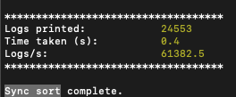

# Trayson Kelii solution

## Implementation

Decided to go with a min-heap (priority queue) which will hold the earliest entry at the top of the heap. Popping and traversing down with the print function allows for keeping memory usage to a minimum while also getting the earliest log entry printed (keeping integrity of synchronous timestamps). The implementation will be the following:

1. Initialize the heap
2. Merge (print) the logs

## Space complexity

O(k) where k is the number of log sources (heap holds one entry per source)

## Time complexity

O(n log k) where n is the number of log entries and log k is the cost of a heap operation

## Async solution

I created a custom heap class `MinHeap` to avoid introducing unnecessary dependencies, but I realized the implementation was running for about 120 secs so I thought if I used an OOTB npm package that was optimized it would yield better results. It only shaved off about 5 seconds (not statistically significant but better). I spent the majority of the time trying different solutions here to try and lower the async time and ran into a myriad of concurrency issues (starting the print function from the heap while dynamically adding async calls on the fly introduced conccurent race conditions). In the end I couldn't find the right balance between maintaining the integrity of the data (sequential order) while trying to optimize for speed (concurrent calls). This was the bottle neck of the application.

Ultimately these were the results (total time spent 90 mins)

