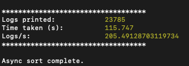
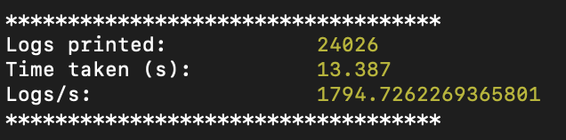

# Trayson Kelii solution

## Implementation

Decided to go with a min-heap (priority queue) which will hold the earliest entry at the top of the heap. Popping and traversing down with the print function allows for keeping memory usage to a minimum while also getting the earliest log entry printed (keeping integrity of synchronous timestamps). The implementation will be the following:

1. Initialize the heap
2. Merge (print) the logs

## Space complexity

O(k) where k is the number of log sources (heap holds one entry per source)

## Time complexity

O(n log k) where n is the number of log entries and log k is the cost of a heap operation

## Async Refactor

1. Concurrency and Asynchronous Operations

   - Initial Implementation: It would fetch the next log from the same source after printing the current log. Other sources were left idle through this process. Limited concurrency; primarily sequential per source.

   - Improved Implementation: It now continuously fetches logs from all sources concurrently, except the `current` one. While waiting for the next log from one source, it won't block fetching from others. Ultimately keeps all sources busy.

2. Data Structures and Control Mechanisms

   - Initial Implementation: There were no additional data structures for concurrency control, but the code was "simpler" with direct `await` on `popAsync()`.

   - Improved Implementation: I've Introduced a `promiseQueue` to keep track of pending fetches. There is also a `currentSource` variable used to prevent conflicts and manage concurrency. This solution introduced more complexity, but allowed for more control over asynchronous operations.

3. Results

   Initial implementation

   

   Refactored implementation

   
